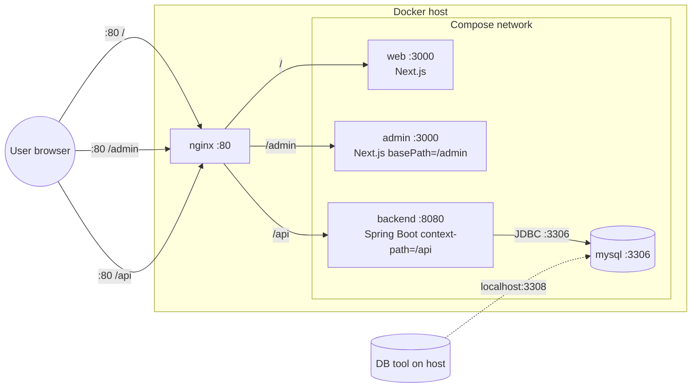
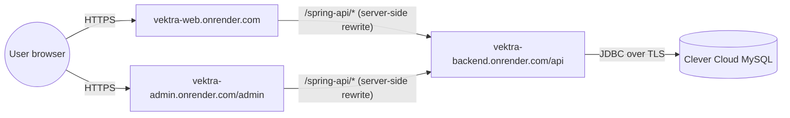

# Architecture

Vektra is a small monorepo with three application services (a public web app,
an admin app, and a Spring Boot backend) sitting behind a single Nginx reverse
proxy and backed by MySQL. The whole stack is containerized with Docker
Compose for local and self-hosted use, and the same three application
services are also deployed to Render's free tier (without Nginx, with an
external managed database).

This document describes **what runs**, **how requests flow through the
system**, and **why** the topology looks the way it does. For deploy steps see
[deployment.md](./deployment.md); to run it on your laptop see
[local-development.md](./local-development.md).

---

## Services

| Service   | Tech                                       | Image / Build                          | Internal port | Host port | Public?              | Source                                            |
| --------- | ------------------------------------------ | -------------------------------------- | ------------- | --------- | -------------------- | ------------------------------------------------- |
| `nginx`   | Reverse proxy                              | `nginx:1.27-alpine`                    | 80            | **80**    | **Yes** (only)       | [`vektra/nginx/nginx.conf`](../vektra/nginx/nginx.conf) |
| `web`     | Next.js 14 (Node 20)                       | built from `apps/web/Dockerfile`       | 3000          | —         | No (`expose:` only)  | [`apps/web/`](../apps/web/)                       |
| `admin`   | Next.js 14 (Node 20), `basePath: /admin`   | built from `apps/admin/Dockerfile`     | 3000          | —         | No                   | [`apps/admin/`](../apps/admin/)                   |
| `backend` | Spring Boot 3 (Java 17), context-path `/api` | built from `vektra/Dockerfile`       | 8080          | —         | No                   | [`vektra/`](../vektra/)                           |
| `mysql`   | MySQL 8.4                                  | `mysql:8.4`                            | 3306          | **3308**  | DB tools only        | volume `mysql_data`                               |

A few details that explain choices you'll see in
[`docker-compose.yml`](../vektra/docker-compose.yml):

- **Nginx is the only service mapped to the host with `ports:`.** Everything
  else uses `expose:` (or no mapping at all), which keeps it reachable on the
  Compose network but invisible from outside the host. Smaller attack
  surface, single TLS termination point later, and no CORS issues for
  browsers because every public path is same-origin.
- **MySQL host port is `3308`, not 3306.** The comment in `docker-compose.yml`
  explains why: it avoids clashing with a local MySQL on 3306 and a
  Docker-Desktop-on-Windows port reservation seen on 3307. Inside the Compose
  network the backend still talks to `mysql:3306`.
- **`backend` waits for `mysql` to pass a healthcheck**, not just to start.
  That's why the first `docker compose up` takes ~30–60 seconds before the
  API responds.

---

## Topologies (two of them)

Vektra runs in **two intentionally different shapes**:

| | Docker Compose | Render (free tier) |
| --- | --- | --- |
| Used for | local dev, self-hosting | staging / demos |
| Edge proxy | Nginx (in repo) | none — each service has its own `*.onrender.com` |
| Browser → API path | `/api/*` (Nginx routes to backend) | `/spring-api/*` (Next.js server-side rewrite) |
| Database | `mysql:8.4` container, volume-backed | external Clever Cloud MySQL |
| Defined in | [`vektra/docker-compose.yml`](../vektra/docker-compose.yml) | [`render.yaml`](../render.yaml) |

The reason Render does not use Nginx is documented at the top of
`render.yaml`: there is no shared edge on Render's free tier, so each service
gets its own public URL. The browser can't call the backend's internal name
(`backend:8080` doesn't exist outside Docker) and shouldn't call
`https://vektra-backend.onrender.com/api/...` directly (cross-origin, leaks
the backend URL). So on Render the browser calls **same-origin**
`/spring-api/...` on the web app's domain, and Next.js's `rewrites()` (server
side) proxies that to `${BACKEND_URL}/api/...`. In Compose, Nginx already is
the same-origin edge, so the browser hits `/api/...` directly and the
Next.js rewrite is bypassed.

---

## Request flows

### 1. Page load — public site (Compose)

```
Browser ── HTTP ──▶ Nginx :80 (location /)
                     └──▶ web :3000 ──▶ returns Next.js page
```

### 2. Page load — admin (Compose)

```
Browser ── HTTP ──▶ Nginx :80 (location /admin)
                     └──▶ admin :3000   (Next.js basePath = /admin)
```

### 3. API call from the browser (Compose)

```
Browser ── HTTP ──▶ Nginx :80 (location /api)
                     └──▶ backend :8080 (Spring, context-path /api)
                           └──▶ mysql :3306
```

The browser does **not** go through `web` or `admin` to reach the API in
Compose — it calls Nginx directly on `/api/*`, because the build sets
`NEXT_PUBLIC_API_URL=/api`.

### 4. API call from the browser (Render)

```
Browser ── HTTPS ──▶ vektra-web.onrender.com /spring-api/...
                      └──▶ Next.js server (rewrites() in next.config.mjs)
                            └──▶ vektra-backend.onrender.com /api/...
                                  └──▶ Clever Cloud MySQL (TLS)
```

Same browser code, different routing layer. The path the browser uses
(`/api` vs `/spring-api`) is decided at **build time** by
`NEXT_PUBLIC_API_URL`.

---

## Diagrams

### Docker Compose topology



### Render topology



---

## Why this matters (design decisions)

- **Single public entry behind Nginx (in Compose)** — one place for TLS, rate
  limiting, gzip, security headers, and request logging. Apps stay private.
- **`expose:` instead of `ports:` for apps and DB** — containers reach each
  other by service name on the Compose network; the host can't. Smaller
  attack surface and no port conflicts on the host.
- **`NEXT_PUBLIC_*` is build-time, not runtime** — these values are literally
  string-replaced into the JS bundle at `npm run build`. Changing them
  requires a rebuild, not a restart. This is why `BACKEND_URL` and
  `NEXT_PUBLIC_API_URL` are passed as `ARG` in the Dockerfiles.
- **Two valid topologies (Compose vs Render)** — because the staging target
  (Render free) doesn't have a shared edge, the apps must work both with and
  without Nginx in front. The `/spring-api` rewrite in `next.config.mjs` is
  the bridge that makes the no-Nginx case work.
- **Healthcheck-gated startup** — backend waits for MySQL to be `healthy`,
  not just running. Slower first boot, but no race conditions on schema
  creation.

---

## Where to look in the code

| You want to understand…                          | Read…                                                                 |
| ------------------------------------------------ | --------------------------------------------------------------------- |
| What services exist and how they wire together  | [`vektra/docker-compose.yml`](../vektra/docker-compose.yml)           |
| How the browser-facing routes are split         | [`vektra/nginx/nginx.conf`](../vektra/nginx/nginx.conf)               |
| How the Spring Boot image is built              | [`vektra/Dockerfile`](../vektra/Dockerfile)                           |
| How the Next.js images are built (build args)   | [`apps/web/Dockerfile`](../apps/web/Dockerfile), [`apps/admin/Dockerfile`](../apps/admin/Dockerfile) |
| The `/spring-api/*` rewrite (Render fallback)   | [`apps/web/next.config.mjs`](../apps/web/next.config.mjs)             |
| How Render is configured                        | [`render.yaml`](../render.yaml)                                       |
| Workspace scripts (`npm run dev:web` etc.)      | [`package.json`](../package.json)                                     |

---

## Glossary

- **Reverse proxy** — a server (here, Nginx) that accepts client connections
  and forwards them to internal services. Clients only see the proxy.
- **Context-path** — the URL prefix Spring Boot serves under. Vektra uses
  `/api`, so `GET /api/v1/users` hits a controller mapped to `/v1/users`.
- **`basePath`** — the equivalent in Next.js. The admin app is built with
  `basePath: /admin` so all of its routes and assets live under `/admin/...`.
- **Build-time env** — value baked into the artifact at build (e.g. into a
  JS bundle). Changing it needs a rebuild.
- **Runtime env** — value read by the process at startup. Changing it needs
  a restart.
