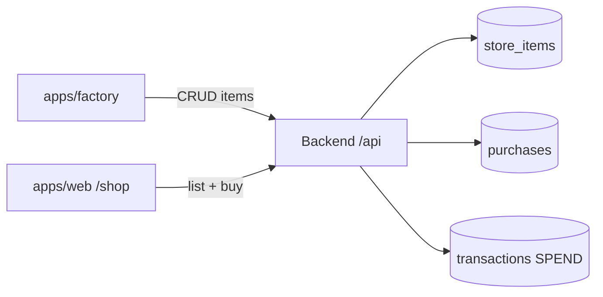

# Factory — store catalog & purchases (v1)

Factory is Vektra's **catalog studio**: admins create sellable items; users buy them
from the web app **Shop** with Vektras. This document locks v1 scope and
architecture. See also [architecture.md](./architecture.md) and
[deployment.md](./deployment.md).

---

## Product split

| Surface | Path | Who | Purpose |
| ------- | ---- | --- | ------- |
| **Factory** | `apps/factory` → `/factory` | Admins | Create, edit, activate/deactivate store items |
| **Shop** | `apps/web` → `/shop` | Users | Browse ACTIVE items, purchase with Vektras |
| **Wallet** | `apps/web` → `/wallet` | Users | Balance + `SPEND` rows from purchases (existing UI) |
| **Backend** | `vektra/` | — | `StoreItem`, `Purchase`, ledger `SPEND` writes |

Admin (`apps/admin`) stays focused on users, tasks, and completions. Any admin
can use Factory — no separate operator role in v1.

---

## Locked decisions (v1)

| Topic | Decision |
| ----- | -------- |
| **Stock** | Per-item `stock` column; **`null` = unlimited**. Integer ≥ 0 when set; decrement on successful purchase. Block purchase when `stock = 0`. |
| **Refunds** | **None in v1.** No `REFUNDED` status, no credit reversal. Add `REFUNDED` + compensating ledger row in a later release. |
| **Factory access** | **Any admin** can access Factory (same identity model as admin app; UI gate only until backend auth hardening). |
| **Images** | **Deferred.** No `imageUrl` column in v1 schema; add when upload/CDN is ready. |
| **Categories** | **Free-text tag** (`category` string, nullable). Used for shop filters, not a separate taxonomy table. |

---

## Domain model

### `store_items`

| Column | Type | Notes |
| ------ | ---- | ----- |
| `id` | BIGINT PK | |
| `name` | VARCHAR | Required |
| `description` | TEXT | Required |
| `price_amount` | INT | Vektras; min 1 |
| `status` | ENUM/VARCHAR | `ACTIVE` \| `INACTIVE` — only ACTIVE in shop |
| `stock` | INT NULL | `NULL` = unlimited; else ≥ 0 |
| `category` | VARCHAR NULL | Free-text tag for filters |
| `created_at`, `updated_at` | TIMESTAMP | |

### `purchases`

| Column | Type | Notes |
| ------ | ---- | ----- |
| `id` | BIGINT PK | |
| `user_id` | BIGINT FK | Buyer |
| `store_item_id` | BIGINT FK | Item snapshot link |
| `amount_paid` | INT | Price at time of purchase |
| `status` | VARCHAR | v1: only `COMPLETED` |
| `created_at` | TIMESTAMP | |

### `transactions` (extend existing ledger)

| New column | Notes |
| ---------- | ----- |
| `purchase_id` | FK to `purchases`; null on non-purchase rows |
| `store_item_id` | Denormalized for wallet/history display |

On purchase: one **COMPLETED `SPEND`** row for the buyer (`amount` = price).

Balance rule (unchanged): `EARN` / `TRANSFER_IN` credit; `SPEND` / `TRANSFER_OUT` debit.

---

## API (v1)

### Catalog — Factory + Shop read

| Method | Path | Caller | Notes |
| ------ | ---- | ------ | ----- |
| `GET` | `/v1/store-items` | Shop, Factory | Shop: `status=ACTIVE` only. Factory: all statuses + optional `?category=` |
| `GET` | `/v1/store-items/{id}` | Shop, Factory | |
| `POST` | `/v1/store-items` | Factory | Create item |
| `PATCH` | `/v1/store-items/{id}` | Factory | Update fields |
| `PATCH` | `/v1/store-items/{id}/status` | Factory | `ACTIVE` / `INACTIVE` |

**Create body example:**

```json
{
  "name": "Coffee voucher",
  "description": "Redeem at the office kitchen.",
  "priceAmount": 50,
  "stock": null,
  "category": "perks"
}
```

### Purchases — Shop

| Method | Path | Caller | Notes |
| ------ | ---- | ------ | ----- |
| `POST` | `/v1/users/{userId}/purchases` | Shop | Body: `{ "storeItemId": 1 }` |
| `GET` | `/v1/users/{userId}/purchases` | Shop | Buyer order history |

**Purchase rules:**

1. Buyer account + wallet **ACTIVE**
2. Item **ACTIVE**, stock available (or unlimited)
3. Ledger balance ≥ `price_amount`
4. Pessimistic lock on buyer wallet (same pattern as `TransferService`)
5. Insert `purchase`, insert `SPEND` transaction, decrement `stock` if not null — **one transaction**

**Errors (mapped today):**

| Condition | HTTP |
| --------- | ---- |
| Insufficient balance | 422 |
| Account/wallet not active | 403 |
| Item not found / inactive / out of stock | 404 or 409 |
| Validation | 400 |

---

## User flows

### Factory (admin creates item)

```
Admin → /factory/items/new → POST /v1/store-items → item in DB (ACTIVE or INACTIVE)
```

### Shop (user buys)

```
User → /shop → GET /v1/store-items → Buy → POST /v1/users/{id}/purchases
  → SPEND row + optional stock-- → wallet shows new balance
```



---

## Monorepo changes

```
apps/factory/          # NEW — basePath /factory, clone admin shell
apps/web/app/shop/     # NEW — storefront
vektra/                # StoreItem, Purchase, services, controllers
vektra/scripts/migrations/002_store_catalog.sql
package.json           # dev:factory, build:factory
docker-compose.yml     # factory service
nginx.conf             # location /factory
render.yaml            # vektra-factory service
```

Types: add to `apps/web`, `apps/admin`, and `apps/factory` `types/vektra.ts` in v1
(consider `packages/types` when touching shared types a fourth time).

---

## Deployment

| Environment | Factory URL |
| ----------- | ----------- |
| Docker Compose | `http://localhost/factory` |
| Render | `https://vektra-factory.onrender.com/factory` |

Same env pattern as admin: `BACKEND_URL`, `NEXT_PUBLIC_API_URL` (`/api` compose, `/spring-api` Render).

**Migration:** run `002_store_catalog.sql` on Clever Cloud manually — do not rely
on `ddl-auto: update` for ENUM/column changes (see migration 001 lesson).

---

## Out of scope (v1)

- Refunds / `REFUNDED` purchase status
- Item images / uploads
- Separate Factory operator role (any admin)
- Fulfillment / shipping states
- Treasury / double-entry on spend (single-user `SPEND` only)
- Kafka changes beyond existing ledger events

---

## Implementation phases

### Phase 1 — Backend ✅
- Migration `002_store_catalog.sql`
- Entities, repositories, mappers, DTOs
- `StoreItemService`, `PurchaseService`, `TransactionService.recordPurchase()`
- Controllers + `PurchaseServiceTest` (happy path + insufficient balance)

### Phase 2 — Factory app ✅
- Scaffold `apps/factory`, items list / create / edit / status toggle
- Docker, nginx, render.yaml, root scripts

### Phase 3 — Shop ✅
- `apps/web/app/shop` — grid, category filter, buy + error handling
- Wallet transaction labels for purchases (item name via `store_item_id`)

### Phase 4 — Later
- Images, refunds, `packages/types`, backend `@PreAuthorize`

---

## Open questions (non-blocking)

- Shop nav label: **Shop** vs **Store**
- Idempotency key on purchase POST (recommended before production traffic)
- Show `stock` on shop cards when finite (“3 left” / “Sold out”)
